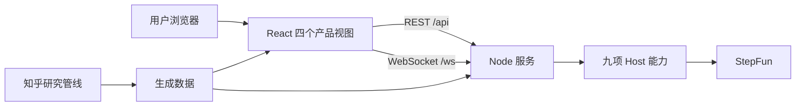

<h1 align="center">争鸣 Dissensus</h1>

<p align="center"><strong>让分歧不止于站队，而是成为可以追问、复盘和继续生长的公共讨论。</strong></p>

<p align="center">知乎黑客松「灵魂匹配局：社区连接与兴趣社交」参赛作品</p>

<p align="center"><code>React 18</code> · <code>TypeScript</code> · <code>D3</code> · <code>Node.js</code> · <code>WebSocket</code> · <code>StepFun</code></p>

## 产品是什么

争鸣围绕知乎的真实问题组织讨论：先从争议地图发现值得谈的问题，再选择立场进入实时辩论，或在辩论树中异步补充论点、证据和追问。事件推演则把用户放进具体社会事件的角色位置，让复杂判断在信息、资源和关系约束中展开。

产品不以裁定谁赢为目标。AI Host 负责整理结构、提出追问和生成复盘，最终留下共识、分歧与仍待回答的问题。

## 四种核心体验

| 模块 | 入口 | 现在可以做什么 |
|---|---|---|
| **辩论树** | `/?view=debate` | 浏览真实议题，在任意节点补充观点、证据或追问；折叠状态保存在本地 |
| **争议地图** | `/?view=map` | 查看跨议题主张簇、缝合关系与反驳关系；支持缩放、聚焦、语义标签和层级切换 |
| **辩论间** | `/?view=room` | 选议题、选边，并选择真人匹配或 AI 对辩；按立论、质询、自由对辩、结辩和报告推进 |
| **事件推演** | `/?view=event` | 选择或生成社会事件，以局内角色逐幕决策；已有可核验事件可在终局选择查看事实线 |

贯穿所有模块的四条原则：

1. **先承认，再推进**：理解对方是继续讨论的前提，但不设置机械复述闸门。
2. **追问权替代验证权**：AI 可以指出需要澄清之处，不替用户裁定对错。
3. **模拟与事实分离**：事件推演期间不展示、也不向模型注入原作轨迹。
4. **不判输赢**：报告呈现六维讨论画像和文本依据，不生成胜负结论。

## 快速开始

需要 Node.js 20 或更高版本。首次运行先安装前端依赖并编译辩论间领域模块：

```bash
cd web
npm install
npm run build:domain
```

复制服务端配置，并按需填写 StepFun 密钥：

```bash
cd ../zhengming-server
cp .env.example .env
# 编辑 .env：STEPFUN_API_KEY=...
npm start
```

另开一个终端启动前端：

```bash
cd web
npm run dev
```

访问 `http://127.0.0.1:5299/?view=room`。开发服务器会把 `/api/*` 和 `/ws/*` 代理到 `127.0.0.1:5300`。未配置密钥时服务仍可启动，并明确标记降级状态；自定义事件生成需要真实模型。

## 系统结构



前端只使用同源相对地址；开发环境由 Vite 代理，生产环境由 Nginx 或 Caddy 代理。服务端使用原生 Node HTTP 与 WebSocket，负责撮合、权威房间状态、AI 对手、Host 调用和报告落盘。

## 仓库结构

```text
zhengming/
├── web/                 Vite + React 应用、领域逻辑和 Vitest 测试
├── zhengming-server/    REST、WebSocket、撮合、Host 与房间报告
├── research/            知乎语料、争议地图发现与生成管线
└── docs/                产品设计、契约、实施与部署文档（仅 Markdown）
```

`web/src/data/controversyMap.ts` 是生成物，不要手工修改；数据更新应从 `research/controversy-map/` 管线进入。

## 测试与构建

```bash
cd web
npm test               # Vitest + Testing Library
npm run build:domain   # 生成服务端复用的辩论间领域模块
npm run build          # 类型检查并构建 web/dist

cd ../zhengming-server
npm test               # Host、HTTP、WebSocket 与撮合集成测试
```

当前基线为前端 **350 项**、服务端 **66 项**测试通过。

## 部署

推荐使用单域名部署，保持浏览器、API 和 WebSocket 同源：

```text
Nginx / Caddy :80/:443
├── /       -> web/dist
├── /api/*  -> 127.0.0.1:5300
└── /ws/*   -> 127.0.0.1:5300
```

构建前先运行 `npm run build:domain`。生产服务器还必须保留 `research/controversy-map/claims.json`，并为 `zhengming-server/rooms/` 提供可写目录。完整操作与平台方案见 [部署路径](docs/design/DEPLOY-PATH.md)。

当前版本适合演示和小规模试用：房间活跃状态仍在单进程内存中，服务重启会中断进行中的房间；尚未实现完整用户认证和公网限流。公开部署时不要暴露 `5300`，并将 `STEPFUN_API_KEY` 只放在服务端环境变量中。

## 设计文档

- [产品总纲](docs/design/README.md)：产品洞察、模块关系与红线
- [实施路径](docs/design/IMPLEMENTATION-PATH.md)：任务卡、决策点和验收命令
- [Host 契约](docs/design/host-contract.md)：九项能力的输入、输出与错误结构

## 项目来源

本项目于 2026-09-13 从 `runi` monorepo 独立成仓，现已不依赖 Runi。实际可运行产品以 `web/` 与 `zhengming-server/` 为准。
